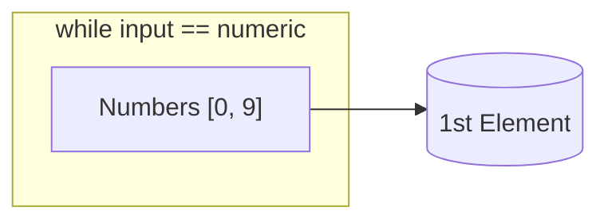
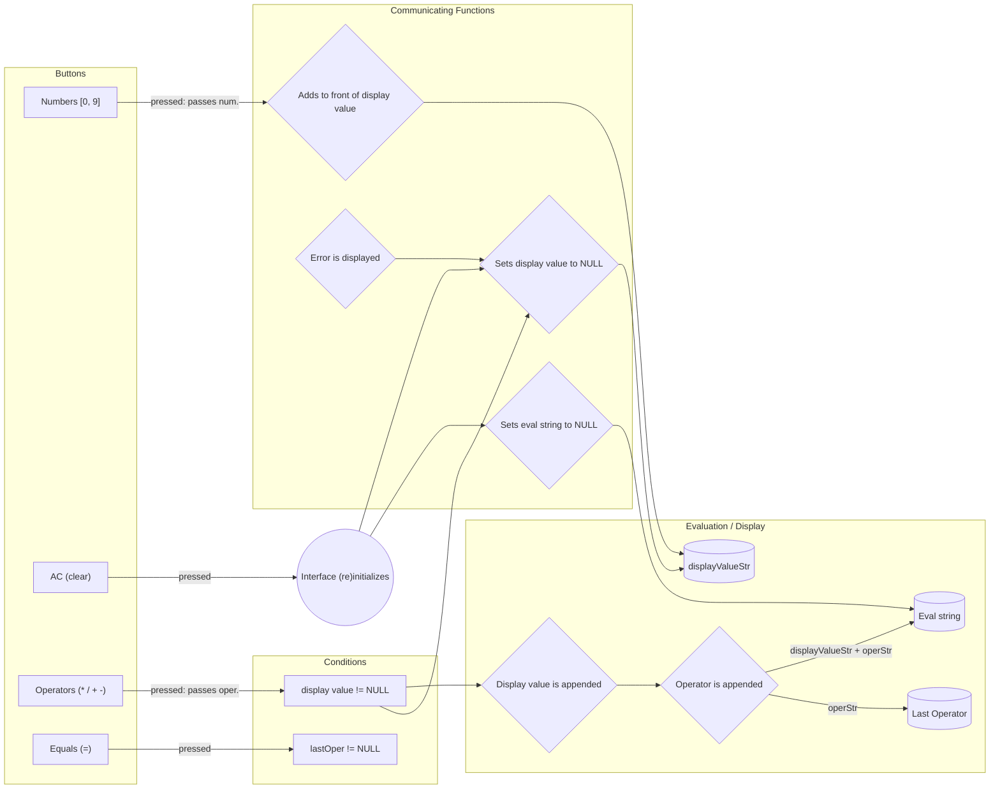

# calculator overview

This project is assigned by The Odin Project and will do the following:

- User can interact with an interface that has numbers [0, 9]
  - There are operations such as:
    - Addition (+)
    - Subtraction (-)
    - Multiplication (x)
    - Division (/)
- The user can perform operations on numbers that they use. A typical interaction is as follows:
  - User presses 9
  - Interface displays 9 at the top
  - User presses \*
  - User presses 9
  - Interface displays 81 at the top
  - User presses -
  - User presses 8
  - Interface displays 74
  - User presses 9
  - Interface displays 9

# PSEUDOCODE: planning & user loop
The evaluation array is the most important thing here, it's: [ (1st number), (operator), (2nd number) ]
User interface does the following:
  - Listens for 1st number pressed
    - Once pressed, it will keep appending to the first number until an operator is pressed
  - Once an operator is pressed, it will append the entire first number to the array, then appends the operator to the 2nd element
  - Then, it listens for more numbers, doing the appending
  - Then, an operator is pressed, it will join the evaluation array into a string, evaluate it, set that to the 1st number of the array, then append the operator to the 2nd element
  - Then continue this loop

# OLD LOOP (incomplete)

