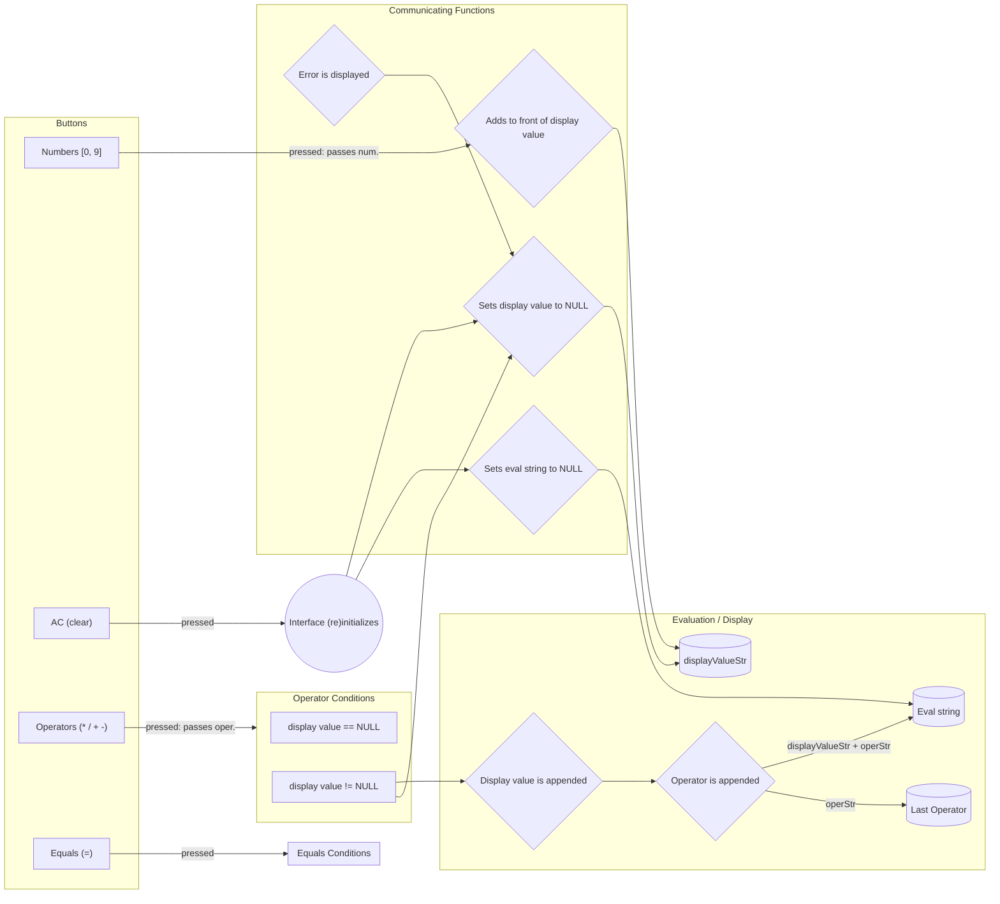

# calculator overview

This project is assigned by The Odin Project and will do the following:

- User can interact with an interface that has numbers [0, 9]
  - There are operations such as:
    - Addition (+)
    - Subtraction (-)
    - Multiplication (x)
    - Division (/)
- The user can perform operations on numbers that they use. A typical interaction is as follows:
  - User presses 9
  - Interface displays 9 at the top
  - User presses \*
  - User presses 9
  - Interface displays 81 at the top
  - User presses -
  - User presses 8
  - Interface displays 74
  - User presses 9
  - Interface displays 9

# PSEUDOCODE: planning & user loop

